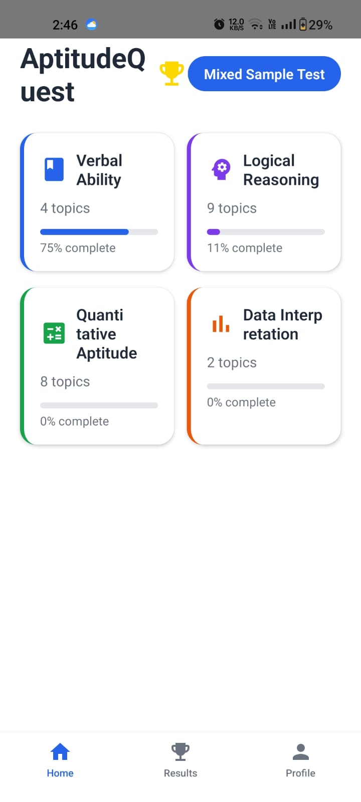
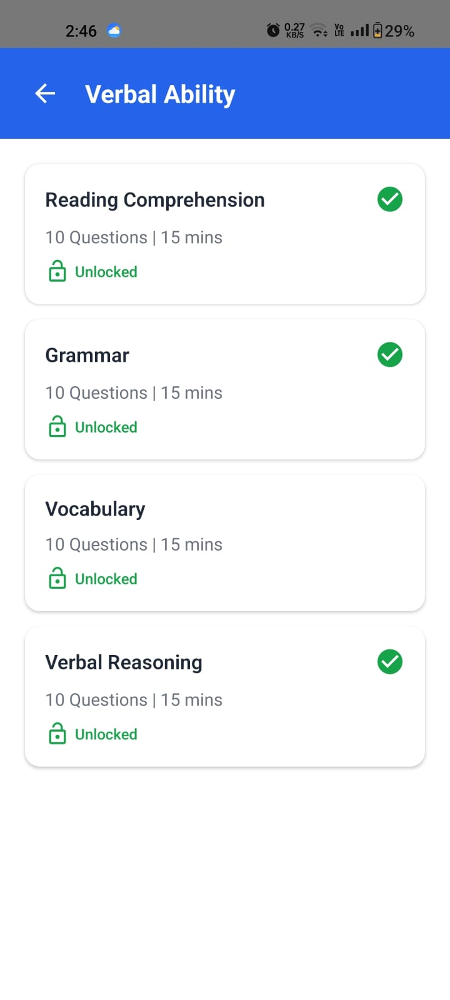
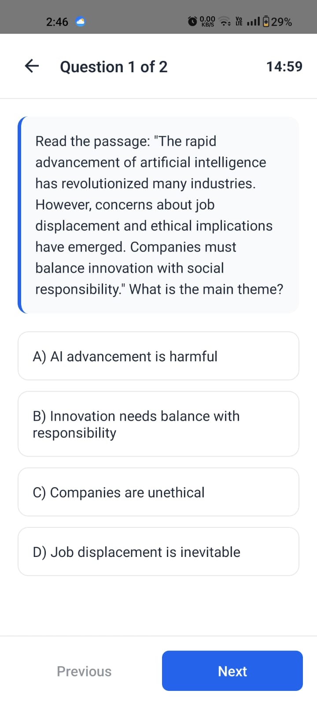
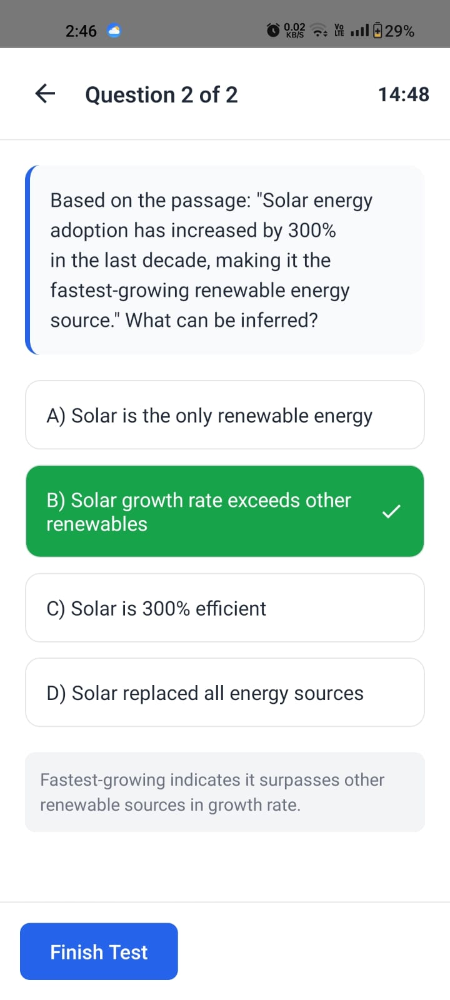
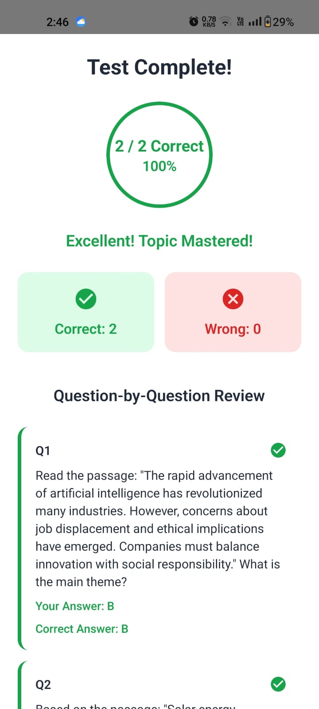
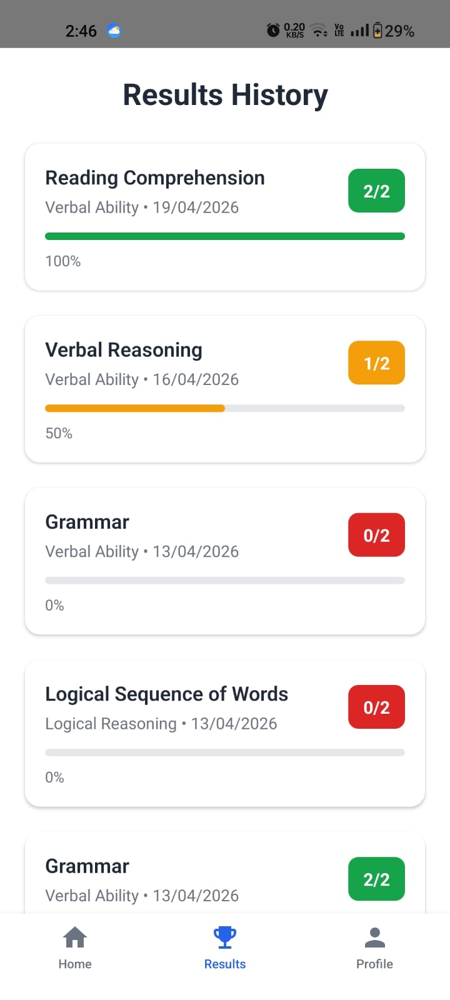

# AptitudeQuest

AptitudeQuest is a mobile aptitude learning and practice app built with React Native, Expo, Firebase Authentication, and Cloud Firestore. It helps students prepare for placement and competitive aptitude rounds through section-wise topics, timed quizzes, sample tests, score history, progress tracking, and gamified learning.

## Screenshots

| Home Dashboard | Topic List | Quiz Question |
| --- | --- | --- |
|  |  |  |

| Answer Feedback | Result Review | Results History |
| --- | --- | --- |
|  |  |  |

## Features

- Email and password signup and login
- Google Sign-In integration
- Persistent Firebase Authentication session
- Home dashboard with aptitude sections, progress percentage, XP, level, and daily streak
- Four learning sections:
  - Verbal Ability
  - Logical Reasoning
  - Quantitative Aptitude
  - Data Interpretation
- Topic-wise explanations and practice questions
- MCQ quiz system with timer, answer confirmation, correct/wrong feedback, and explanations
- Result screen with score, accuracy, question-wise review, and retry option
- Mixed and section-wise sample tests
- Firestore-based progress tracking for attempts, completed topics, scores, badges, streaks, XP, and level
- Clean mobile UI with card-based layouts and smooth navigation

## Tech Stack

- React Native
- Expo
- Firebase Authentication
- Cloud Firestore
- React Navigation
- Expo Vector Icons

## Project Structure

```text
components/       Reusable UI components
data/             Sample sections, topics, questions, and tests
docs/screenshots/ App screenshots used in this README
navigation/       Stack and tab navigation
screens/          App screens for auth, home, quiz, result, tests, and progress
services/         Firebase config, auth helpers, and Firestore progress services
```
